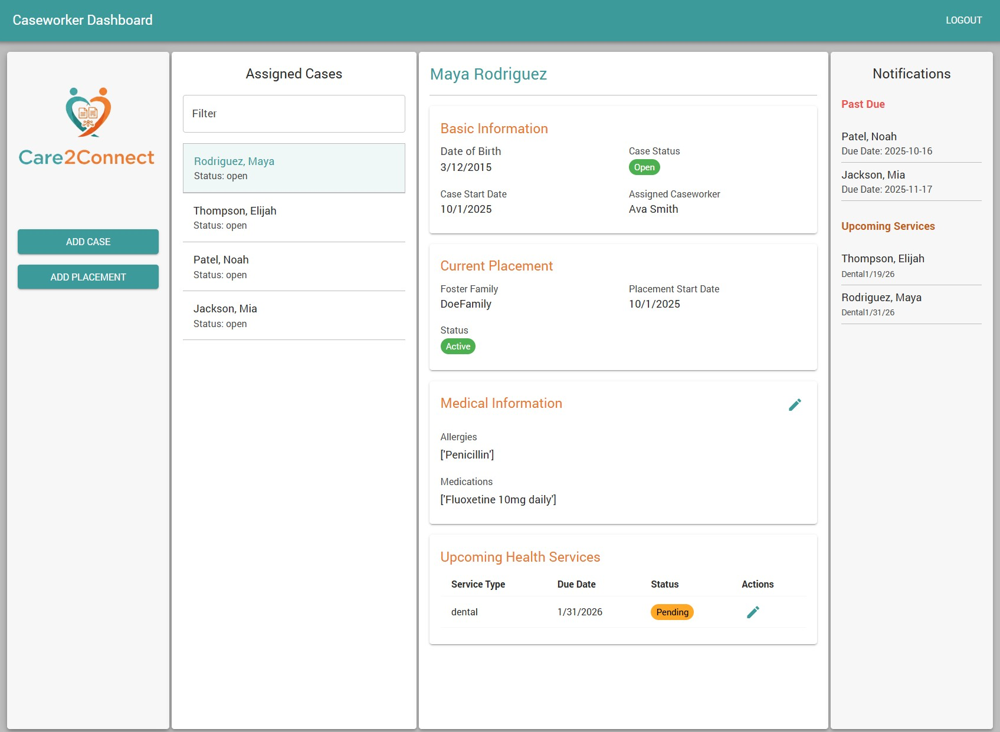
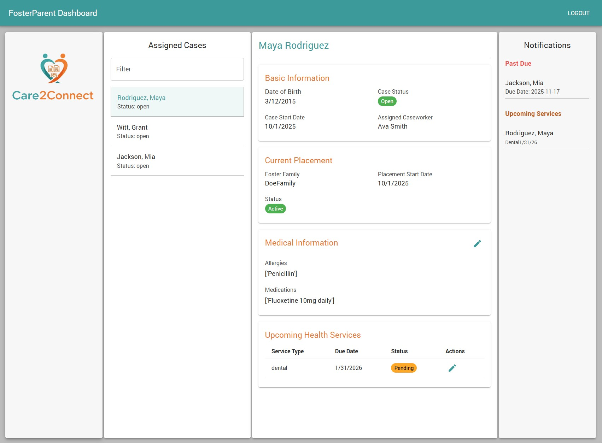

# Care2Connect

A foster care case management system built to help caseworkers, supervisors, and foster parents coordinate EPSDT-required health services for children in care.

EPSDT (Early and Periodic Screening, Diagnostic, and Treatment) is the federal program requiring states to provide preventive health screenings, well-child visits, immunizations, and dental exams for Medicaid-enrolled children. This includes children in foster care who have higher rates of chronic illness and greater healthcare needs than the general population and are also more likely to miss these  needed appointments. Care2Connect helps by centralizing health records and sending reminders to caseworkers and foster families when appointments are coming due.

**Security Note** This application does not have HIPAA compliant security measures and should not be used to store any sensitive information or PHI. All data in the screenshots below are mock data created by the developer for testing purposes.

## What It Does

When a child enters foster care and a case is opened, the system automatically generates a schedule of upcoming health service appointments based on the child's age and the EPSDT immunization and well-child visit guidelines. Caseworkers and foster parents can view upcoming and overdue services, record completed visits, and track immunization history. A background task checks monthly for new services that need scheduling and sends email reminders at 30, 14, and 7 days before due dates.

The app supports three user roles with different access levels:

- **Supervisors** manage the system, creating user accounts, entering children, opening cases, and assigning caseworkers.
- **Caseworkers** see the children on their active caseload along with full case history, placement details, and health records. They can create and manage foster placements and update health service records.
- **Foster Parents** see the children currently placed in their home. They can update medical information (medications, allergies) and record health visit completions.

Each role only sees data relevant to their responsibilities. Caseworkers can't access another caseworker's cases. Foster parents can't see children not placed with them.

## Screenshots

### Caseworker Dashboard


### Foster Parent Dashboard


## Tech Stack

**Backend:** Django REST Framework, PostgreSQL, JWT authentication (SimpleJWT), Django-Q for scheduled tasks

**Frontend:** React, Material-UI, Axios, React Hook Form

## Architecture

The backend is a standard Django REST API with a few things worth noting:

**Automated health service scheduling** — `generate_health_services()` in `models.py` takes a child and a reference date, walks the EPSDT immunization schedule and well-child visit timeline, checks for existing records to avoid duplicates, and creates `HealthService` records for anything due in the next 90 days. This runs both on case creation and as a monthly background task.

**Role-based access control** — Permissions are handled in two layers. Django's built-in group permissions (`setup_groups.py`) control what actions each role can perform (e.g., caseworkers can't create cases). A custom DRF permission class (`permissions.py`) handles object-level access by checking whether the specific record belongs to a child on the user's caseload. Queryset filtering in `mixins.py` ensures list endpoints only return data the user should see.

**EPSDT schedule data** — The immunization schedule, well-child visit ages, and dental intervals are defined in `constants.py` as a data structure rather than hardcoded logic. Adding a new vaccine or adjusting visit timing is a data change, not a code change.

## API Documentation

With the server running, interactive API docs are available at:

```
http://localhost:8000/api/docs/
```

## Setup

### Prerequisites
- Python 3.10+
- Node.js 18+
- PostgreSQL

### Backend

```bash
cd backend
python -m venv venv
source venv/bin/activate  # Windows: venv\Scripts\activate
pip install -r requirements.txt
```

Create a `.env` file in the `backend` directory:

```
SECRET_KEY=your-secret-key
DEBUG=True
DATABASE_NAME=care2connect
DATABASE_USER=your-db-user
DATABASE_PASSWORD=your-db-password
DATABASE_HOST=localhost
DATABASE_PORT=5432
```

```bash
python manage.py migrate
python manage.py setup_groups
python manage.py createsuperuser
python manage.py runserver
```

### Frontend

```bash
cd frontend
npm install
```

Create a `.env` file in the `frontend/src` directory:

```
REACT_APP_API_URL=http://localhost:8000
```

```bash
npm start
```

### Running Tests

```bash
cd backend
python manage.py test c2c.tests
```
